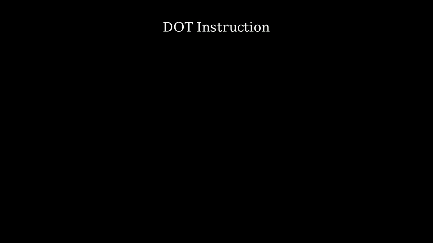
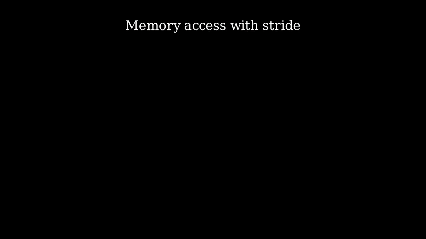
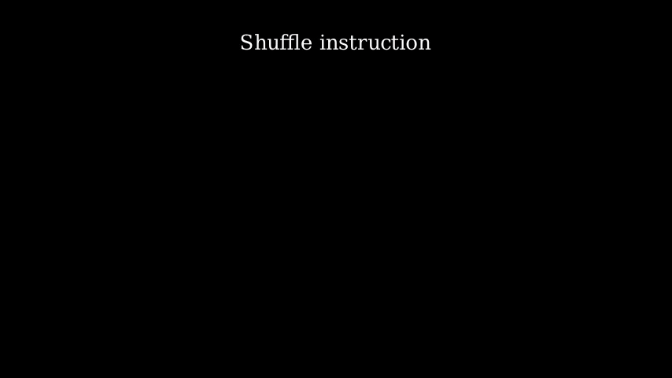

# ISA Scenes

When users want to create one animation for ISA, import `isa_manim` at the start of the source file.

Then, like Manim, one class should be created to describe the behavior within the animation. The class should choose one of `SingleIsaScene` and `MultiIsaScene` as the base class.

``` python
from isa_manim import SingleIsaScene 

class TestSingleIsaScene(SingleIsaScene):
    ...
```

Or

``` python
from isa_manim import MultiIsaScene

class TestMultiIsaScene(MultiIsaScene):
    ...
```

The differences between `SingleIsaScene` and `MultiIsaScene` lie in the layout of scenes.

Both `SingleIsaScene` and `MultiIsaScene` separate the scene into the title and zoom parts. The zoom part contains objects (registers, functions, and memory units) and performs animations. When adding new objects or removing some objects from the scene, the zoom part will be scaled or moved to fit all objects within the middle of the scene.

The title part does not scale during animations. `SingleIsaScene` only provides one title in the title part. `MultiIsaScene` provides both the title and subtitle in the title part. The title remains the same, but the subtitle can change during animation.

`SingleIsaScene.draw_title` and `MultiIsaScene.draw_title` draw the title on the scene. `MultiIsaScene.draw_subtitle` fades in the subtitle.

The animation class should overwrite the behavior of the function `construct_isa_flow`. In the `construct_isa_flow`, users do not need to pay much attention to the animation flow but focus on describing the behavior of instructions. Within `construct_isa_flow`, users can use the APIs provided in [Animation APIs](02-animation-apis.md)

> It is not recommand to apply objects and animations provided in `isa_manim.isa_object` and `isa_manim.isa_animate` directly. It is a little complex to create a new object and a kine of animation in the animation classes.

## ISA Animation Flow Management

ISAManim made a significant effort to hide the animation flow management behind the APIs that describe the instruction behavior.

First, ISAManim automatically places objects (register, function, and memory units) on the scene. See [Placement](../1-references/30-scene/32-placement.md) for details.

Then, ISAManim schedules animations according to the dependency between animations. Manim APIs are hidden behind ISAManim APIs. See [Animation Flow](../1-references/30-scene/33-animation-flow.md) for details.

For example, users can expand the loop manually and play animations simultaneously for vector instructions.

``` python
opa_list = [self.read_elem(zn, e) for e in range(0, elements)]
opb_list = [self.read_elem(zm, e) for e in range(0, elements)]
res_list = [self.function_call(f"binop{e}", [opa_list[e], opb_list[e]]) for e in range(0, elements)]
res_list = [self.move_elem(res_list[e], zd, e) for e in range(0, elements)]
```

Otherwise, users can write the operation of vector instructions in one loop, as shown below. ISAManim analyzes the dependency of animations and expands the loop automatically.

``` python
for e in range(0, elements):
    op_a = self.read_elem(zn, e)
    op_b = self.read_elem(zm, e)
    res = self.function_call(f"binop{e}", [op_a, op_b])
    self.move_elem(res, zd, e)
```

The above two code pieces result in the same animation.

Further, the color of each element unit is assigned from a specified color scheme. Element units generated at the same position in the source code share the same color. For example, `op_a`, `op_b`, and `res` will be assigned different colors. However, `op_a` for different `e` among the loop share the same color. Similarly, `op_b` and `res` for different `e` also share the same color. See [Color Map](../1-references/30-scene/31-color-map.md) for details.

### Manual Control

In addition to automatic placement and animation flow, ISAManim provides several methods for users to control the generated animation.

Users can control the object placement through several options in APIs:

1. Users can place the generated object in the same row as one specified object with the option `align_with`.
2. Users can place one group of function units in the same row with the option `force_hw_ratio`. Otherwise, the number of units in the same row is auto-adjusted to fit the scene.

Users can use `end_section()` to control the animation flow. `end_section` performs like a barrier. Animations before the `end_section` in programming order must finished before the `end_section`. Meanwhile, Animations after the `end_section` in programming order must start after the `end_section`.

Take the above vector instruction as an example again. The animation of the first element plays separately from animations of other elements because `end_section` is called when `e` is 0.

``` python
for e in range(0, elements):
    op_a = self.read_elem(zn, e)
    op_b = self.read_elem(zm, e)
    res = self.function_call(f"binop{e}", [op_a, op_b])
    self.move_elem(res, zd, e)

    if e == 0:
        self.end_section(wait=1, fade_out=False)
```

`end_section` provides the following options:

- The option `wait` specifies the duration between sections. A suitable pause can help audiences to understand the animation.
- The option `fade_out` specifies whether all objects on the scene should be faded out. The default value is `True`, which removes all objects.

> The option `fade_out` controls the subtitle but does not control the title.

The following options are only available in `MultiIsaScene`.

- `keep_objects` specifies which objects and element units should be kept on the scene while other objects should be faded out. This option benefits one animation with several phases, like CISC-style instructions.
- `keep_pos` specifies whether the position of objects within `keep_objects` should be kept.

## Examples



Source code: [*test_single_isa_scene_mem.py*](https://github.com/wangeddie67/isa_manim/blob/main/tests/isa_scene/test_single_isa_scene_mem.py)



Source code: [*test_single_isa_scene_mem.py*](https://github.com/wangeddie67/isa_manim/blob/main/tests/isa_scene/test_single_isa_scene_mem.py)



Source code: [*test_multi_isa_scene.py*](https://github.com/wangeddie67/isa_manim/blob/main/tests/isa_scene/test_multi_isa_scene.py)

## isa_scene

### ISA Scene for Single Instruction

`isa_manim.isa_scene.single_isa_scene.SingleIsaScene` is used to describe one single instruction. `SingleIsaScene` only provides one title. The function `draw_title` sets the title of the animation.

The height of the frame is 9, while the width of the frame is 16.

`isa_manim.isa_scene.single_isa_scene.SingleIsaScene` applies `ZoomedScene`. The camera frame of the zoomed scene covers the area of the object placement, while the display frame covers the area below the title (from 3.0 to the bottom, from the left to the right).

::: isa_manim.isa_scene.single_isa_scene.SingleIsaScene

### ISA Scene for Multiple Instructions

`isa_manim.isa_scene.multi_isa_scene.MultiIsaScene` performs the same behavior, except it provides one subtitle below the title. The functions `draw_subtitle` and `start_section` set the subtitle of the animation. The display frame of the zoomed scene covers the area below the subtitle (from 2.0 to the bottom, from the left to the right).

Moreover, `MultiIsaScene` provides the function `start_section` to reset the object placement and animation scheduling. `start_section` should be placed before each section, as below:

```python
def construct_isa_flow(self):
    self.start_section("instruction 1")
    # Instruction behaviors.
    self.end_section()

    self.start_section("instruction 2")
    # Instruction behaviors.
    self.end_section()
```

::: isa_manim.isa_scene.multi_isa_scene.MultiIsaScene
