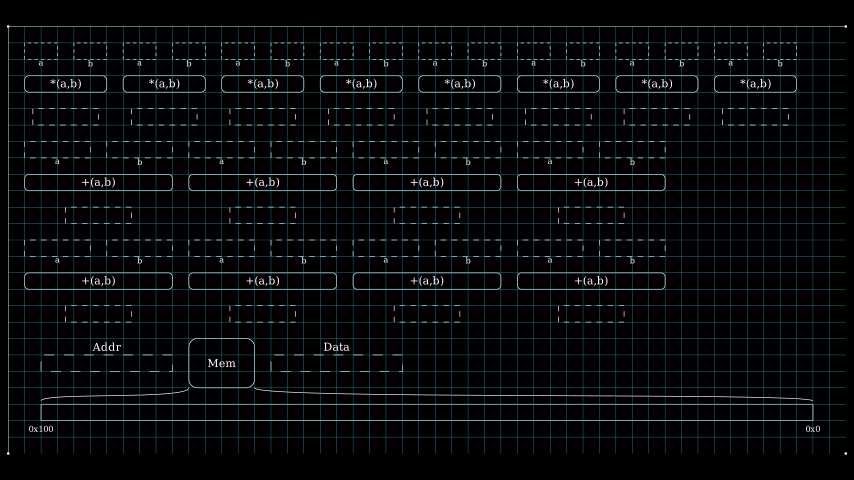

# Object Placement

As explained in previous pages, the object placement algorithm and function interfaces are hidden behind the APIs provided by scenes. However, it would be useful to understand the placement algorithm so that users can use options in API to guide the final placement.

ISA objects are placed into the placement according to a specified algorithm. `isa_manim.isa_scene.isa_placement.IsaPlacementMap` provides the implementation and function interfaces. `IsaPlacementMap` provides two primary functions:

- Object dictionary for all registers, function units, and memory units within the animation.
- Placement objects into a scalable scene.

By default, the area of the placement is defined by `config.frame_height` and `config.frame_width`. The upper-left corner of the placement is the origin point of the frame. With the increasing of objects, the placement range is scaled, but the ratio of height and width is fixed.

The placement algorithm must address the following limitations:

- There is a margin of 1.0 around each object in all directions.
- There is a margin of 1.0 between each object and the placement boundary.
- The ratio of height and width of the placement is kept as the h/v ratio of the frame.
- In one row, only the same kind of object can be allocated.
  - For example, function units can be placed vertically aligned, but function units cannot be placed in the same row with registers.

## Placement Map

The area of the placement is abstracted as a grid. Each coordinate in the grid presents 1.0 in the vertical or horizontal direction. Objects are abstracted as rectangles with integer width and height as well. For example, if the width of one object is 3.2 and the height of one object is 4.6, that object will occupy one rectangle of 4 in horizontal and 5 in vertical.

The status of one 1.0x1.0 square in the grid is present by one integer:

- 0 means the item is free to allocate;
- 1 means the item is a margin between objects or a margin around placement.
- 2 means the item is occupied by a register.
- 3 means the item is occupied by a function unit.
- 4 means the item is occupied by a memory unit.

The status of all squares construct an array, referenced as a placement map:

```
1 1 1 1 1 1 1 1 1 1 1 1 1 1 1 1 1 1 1 1 1 1 1 1 1 1 1 1 1 1 1 1 1 1 1 1 1 1 1 1 1 1 1 1 1 1 1 1 1 0 0
 ----------- ----------- ----------- ----------- ----------- ----------- ----------- -----------
1|2 2 2 2 2|1|2 2 2 2 2|1|2 2 2 2 2|1|2 2 2 2 2|1|2 2 2 2 2|1|2 2 2 2 2|1|2 2 2 2 2|1|2 2 2 2 2|1 0 0
1|2 2 2 2 2|1|2 2 2 2 2|1|2 2 2 2 2|1|2 2 2 2 2|1|2 2 2 2 2|1|2 2 2 2 2|1|2 2 2 2 2|1|2 2 2 2 2|1 0 0
1|2 2 2 2 2|1|2 2 2 2 2|1|2 2 2 2 2|1|2 2 2 2 2|1|2 2 2 2 2|1|2 2 2 2 2|1|2 2 2 2 2|1|2 2 2 2 2|1 0 0
1|2 2 2 2 2|1|2 2 2 2 2|1|2 2 2 2 2|1|2 2 2 2 2|1|2 2 2 2 2|1|2 2 2 2 2|1|2 2 2 2 2|1|2 2 2 2 2|1 0 0
1|2 2 2 2 2|1|2 2 2 2 2|1|2 2 2 2 2|1|2 2 2 2 2|1|2 2 2 2 2|1|2 2 2 2 2|1|2 2 2 2 2|1|2 2 2 2 2|1 0 0
 ----------- ----------- ----------- ----------- ----------- ----------- ----------- -----------
1 1 1 1 1 1 1 1 1 1 1 1 1 1 1 1 1 1 1 1 1 1 1 1 1 1 1 1 1 1 1 1 1 1 1 1 1 1 1 1 1 1 1 1 1 1 1 1 1 0 0
 ------------------- ------------------- ------------------- -------------------
1|3 3 3 3 3 3 3 3 3|1|3 3 3 3 3 3 3 3 3|1|3 3 3 3 3 3 3 3 3|1|3 3 3 3 3 3 3 3 3|1 0 0 0 0 0 0 0 0 0 0
1|3 3 3 3 3 3 3 3 3|1|3 3 3 3 3 3 3 3 3|1|3 3 3 3 3 3 3 3 3|1|3 3 3 3 3 3 3 3 3|1 0 0 0 0 0 0 0 0 0 0
1|3 3 3 3 3 3 3 3 3|1|3 3 3 3 3 3 3 3 3|1|3 3 3 3 3 3 3 3 3|1|3 3 3 3 3 3 3 3 3|1 0 0 0 0 0 0 0 0 0 0
1|3 3 3 3 3 3 3 3 3|1|3 3 3 3 3 3 3 3 3|1|3 3 3 3 3 3 3 3 3|1|3 3 3 3 3 3 3 3 3|1 0 0 0 0 0 0 0 0 0 0
1|3 3 3 3 3 3 3 3 3|1|3 3 3 3 3 3 3 3 3|1|3 3 3 3 3 3 3 3 3|1|3 3 3 3 3 3 3 3 3|1 0 0 0 0 0 0 0 0 0 0
 ------------------- ------------------- ------------------- -------------------
1 1 1 1 1 1 1 1 1 1 1 1 1 1 1 1 1 1 1 1 1 1 1 1 1 1 1 1 1 1 1 1 1 1 1 1 1 1 1 1 1 0 0 0 0 0 0 0 0 0 0
 ------------------- ------------------- ------------------- -------------------
1|3 3 3 3 3 3 3 3 3|1|3 3 3 3 3 3 3 3 3|1|3 3 3 3 3 3 3 3 3|1|3 3 3 3 3 3 3 3 3|1 0 0 0 0 0 0 0 0 0 0
1|3 3 3 3 3 3 3 3 3|1|3 3 3 3 3 3 3 3 3|1|3 3 3 3 3 3 3 3 3|1|3 3 3 3 3 3 3 3 3|1 0 0 0 0 0 0 0 0 0 0
1|3 3 3 3 3 3 3 3 3|1|3 3 3 3 3 3 3 3 3|1|3 3 3 3 3 3 3 3 3|1|3 3 3 3 3 3 3 3 3|1 0 0 0 0 0 0 0 0 0 0
1|3 3 3 3 3 3 3 3 3|1|3 3 3 3 3 3 3 3 3|1|3 3 3 3 3 3 3 3 3|1|3 3 3 3 3 3 3 3 3|1 0 0 0 0 0 0 0 0 0 0
1|3 3 3 3 3 3 3 3 3|1|3 3 3 3 3 3 3 3 3|1|3 3 3 3 3 3 3 3 3|1|3 3 3 3 3 3 3 3 3|1 0 0 0 0 0 0 0 0 0 0
 ------------------- ------------------- ------------------- -------------------
1 1 1 1 1 1 1 1 1 1 1 1 1 1 1 1 1 1 1 1 1 1 1 1 1 1 1 1 1 1 1 1 1 1 1 1 1 1 1 1 1 1 1 1 1 1 1 1 1 1 1
 ---------------------------------------------------------------------------------------------------
1|4 4 4 4 4 4 4 4 4 4 4 4 4 4 4 4 4 4 4 4 4 4 4 4 4 4 4 4 4 4 4 4 4 4 4 4 4 4 4 4 4 4 4 4 4 4 4 4 4|1
1|4 4 4 4 4 4 4 4 4 4 4 4 4 4 4 4 4 4 4 4 4 4 4 4 4 4 4 4 4 4 4 4 4 4 4 4 4 4 4 4 4 4 4 4 4 4 4 4 4|1
1|4 4 4 4 4 4 4 4 4 4 4 4 4 4 4 4 4 4 4 4 4 4 4 4 4 4 4 4 4 4 4 4 4 4 4 4 4 4 4 4 4 4 4 4 4 4 4 4 4|1
1|4 4 4 4 4 4 4 4 4 4 4 4 4 4 4 4 4 4 4 4 4 4 4 4 4 4 4 4 4 4 4 4 4 4 4 4 4 4 4 4 4 4 4 4 4 4 4 4 4|1
1|4 4 4 4 4 4 4 4 4 4 4 4 4 4 4 4 4 4 4 4 4 4 4 4 4 4 4 4 4 4 4 4 4 4 4 4 4 4 4 4 4 4 4 4 4 4 4 4 4|1
1|4 4 4 4 4 4 4 4 4 4 4 4 4 4 4 4 4 4 4 4 4 4 4 4 4 4 4 4 4 4 4 4 4 4 4 4 4 4 4 4 4 4 4 4 4 4 4 4 4|1
 ---------------------------------------------------------------------------------------------------
1 1 1 1 1 1 1 1 1 1 1 1 1 1 1 1 1 1 1 1 1 1 1 1 1 1 1 1 1 1 1 1 1 1 1 1 1 1 1 1 1 1 1 1 1 1 1 1 1 1 1
```

## Place one Single Object

The placement algorithm became one question to find one rectangle space in the placement 
array, which addresses all the following conditions:

- The candidate rectangle space is free to allocate (all squares are 0)
- The candidate rectangle is large enough for the object to be placed.
- Squares around the candidate rectangle have not been allocated by another object (all squares are 0 or 1). So that there will be at least a margin of 1.0 between the new object and existing objects.
- All items on the same row with the candidate rectangle should be free (0), margin (1), or the same type of the new object to be placed.
- 
By default, the placement algorithm searches the candidate space among the placement map using the "RB" or "BR" strategy. The "RB" strategy means attempting to place the new object **beside** existing items first. The "BR" strategy means attempting to place the new object **below** existing items first. The default strategy is "RB".

The initial size of the placement map is determined by `config.frame_width` and `config.frame_height`. With the increase of objects, the initialized size is insufficient in most situations. When there is no space for one new object, the placement map is extended before another try. The extension does not change the ratio of horizontal and vertical. For example, if the initialized height is 9 and the initialized width is 16, the step to extend the placement map would be:

(16,9) -> (17,10) -> (18,11) -> (19,11) -> (20,12) ...

Besides the "RB" or "BR" strategies, `align_with` is another way to guide the placement algorithm. When `align_with` is specified, the new object is placed in the same row as the specified `align_with`. The placement map is extended if there is not enough space for the new object.

> The specified object by `align_with` must be the same type as the new object. Otherwise, the program will fill in dead-loop.


Source code: [*test_isa_placement_map.py*](https://github.com/wangeddie67/isa_manim/blob/main/tests/isa_scene/test_isa_placement_map.py)

As shown in the above figure, Zm is placed in a position aligned with Zn.

## Place a Group of Objects

Animations need a group of function units for vector instructions to handle vector elements parallelly. Considering that they are good-looking, these function units are placed into the placement map as a group. Then, each function unit is placed into the placement map within the group's space. A group of objects cannot be aligned with any other objects.

The space occupied by a group of objects depends on the number of objects in one row. The number is auto-adjusted according to the horizontal and vertical ratio of the placement map. The h/v ratio of the group of objects should not be smaller than the h/v ratio of the placement map.

As shown in the below example, the h/v ratio of the group is 16/9=1.778. The h/v ratio of "+(a,b)" function units is 39/11=3.545, larger than 1.778. If only two function units are in one row, the h/v ratio of "+(a,b)" function units is 19/23=0.826, smaller than 1.778.



Source code: [*test_isa_placement_map_2.py*](https://github.com/wangeddie67/isa_manim/blob/main/tests/isa_scene/test_isa_placement_map_2.py)

Instead of the auto-adjust shape, the option `force_hv_ratio` forces all function units in one row. As the "*(a,b)" function units in the above figure.

Please reference to [Reference/Scene/Object Placement](../1-references/30-scene/32-placement.md) for implementation.

## Keep Objects between Section

Some objects should be kept in the scene between sections for animations with multiple sections. The option `keep_objects` specifies a list of objects to be kept.

All objects are removed during the switching of sections, and the placement map is reset to the initialized size. Then, the objects specified by `keep_objects` are added back with the same hash value. If option `keep_pos` is 1, these objects are added at the same position in the previous section. Otherwise, the positions of these objects are recalculated.

