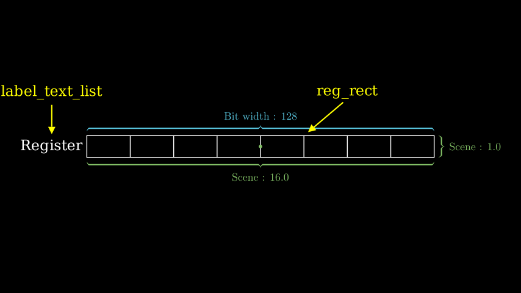
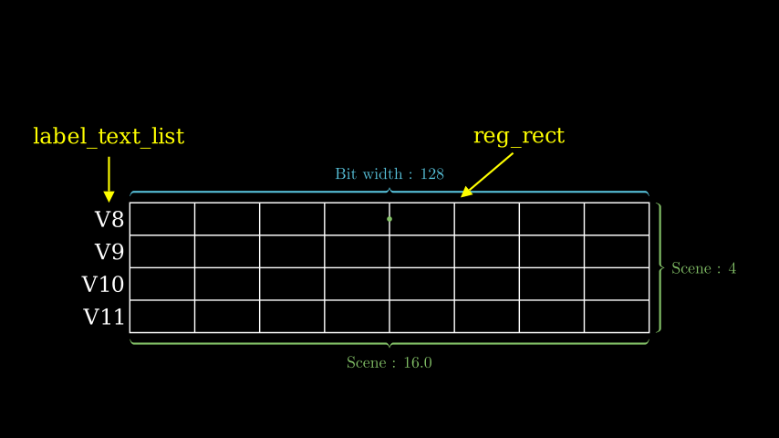

# Register Unit

`isa_manim.isa_objects.reg_unit` presents one single register or a group of registers. It can be used for general-purpose registers, vector registers and matrix registers.

One example of a single register is as below:

Source code: [*test_one_dim_reg.py*](https://github.com/wangeddie67/isa_manim/blob/main/tests/isa_objects/test_one_dim_reg.py)

One example of a list of registers is as below:

Source code: [*test_two_dim_reg.py*](https://github.com/wangeddie67/isa_manim/blob/main/tests/isa_objects/test_two_dim_reg.py)

As shown in the above figures, one register unit contains the following Manim objects:
- `reg_rect` presents the register.
  - The width of `reg_rect` presents the bit width of the register.
  - The height of `reg_rect` presents the number of registers or the row count of one matrix register. If there is only one register, the height is 1.0. 
- `label_text_list` contains the labels that present the name of the register. The vertical distance between the position of labels is 1.0. The right boundary of labels is close to the left boundary of `reg_rect`.

> As the green dot shown in the above figures, the origin point of one register unit is located in the center position of the first row in `reg_rect`, which is different from the geometry center position of this object. It is suggested to use function `shift` rather than function `move_to` to change the location of the register.

Function `get_elem_center` returns the position of one specified element. The bit width of the specified element can be different from the element bit width of the vector. 

Register units can maintain values of the register in the format of one single value (for GPRs), a 1-D array of values (for vector registers) or a 2-D array of values (for matrix registers). Function `get_elem_value` returns the value of one specified element, while function `set_elem_value` modifies the value of one specified element.

> Thus, arguments for all methods are designed to support matrix registers. If creating or operating on vector registers, `nreg` must be 1 in the constructor function and `reg_idx` is ignored in other methods. If creating or operating on general-purpose registers, `elements` must be 1 in the constructor function and `index` is ignored in other methods.

## RegUnit

::: isa_manim.isa_objects.reg_unit.RegUnit
