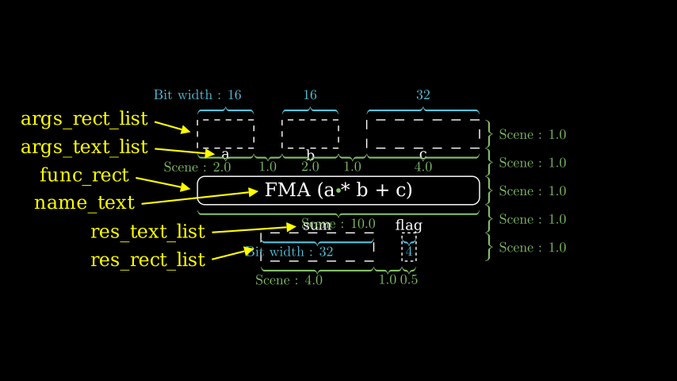

# Function Units

`isa_manim.isa_objects.func_unit` presents one function unit in ISA flow. This object can be used to present one operator (like +/-) or one predefined function (like max/min).

This object provides the name of the function, as well as input arguments and output results. One function unit can have as many input arguments and output results as necessary.

Source code: [*test_func_unit.py*](https://github.com/wangeddie67/isa_manim/blob/main/tests/isa_objects/test_func_unit.py)

As shown in the above figure, one function unit contains the following Manim objects:
- `func_rect` presents the function unit.
  - The width of `func_rect` should cover all source and destination operands.
- `name_text` presents the name of the function unit, which centrally aligns with `func_rect`.
- `args_rect_list` and `res_rect_list` present the group of source operands and the group of destination operands.
  - Each operand is presented by one dot rectangle.
  - The width of each rectangle in `args_rect_list` and `res_rect_list` presents the bit width of the corresponding operand.
- `args_text_list` and `res_text_list` present the group of names of source operands and the group of names of destination operands.
  - One Text item in `args_text_list` and `res_rect_list` horizontally aligns with the corresponding rectangle in `args_rect_list` and `res_rect_list`. The Text item is also vertically below the corresponding rectangle.

The height of `func_rect`, `args_rect_list`, `res_rect_list` is 1.0. Then, a gap of 1.0 is added between these Manim objects in veritial. So, the total height of one function unit is 5.0. 

> The origin point is located in the center position of `func_ellipse`. The function unit is symmetrical about the center of the origin.

Function `get_arg_pos` and `get_res_pos` return the position of one specified source and destination operand separately. The bit width of the specified element can be different from the bit width of the operand.

The function unit maintains one pointer to function in `func_callee`. The assigned function can be one complete function or an inline function (lambda function). When performing function calling animations, the assigned function can operate on the value from element units of source operands and return the output value. Member functions cannot be assigned to `func_callee` because positional operation `self` cannot be passed to `func_callee`.

## FunctionUnit

::: isa_manim.isa_objects.func_unit.FunctionUnit
