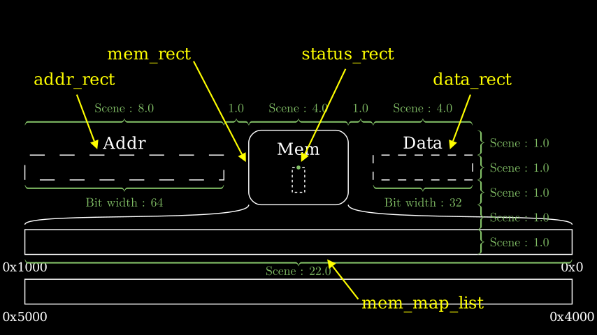

# Memory Unit

`isa_manim.isa_object.mem_unit.MemUnit` presents one memory unit in ISA.

Source code: [*test_mem_unit.py*](https://github.com/wangeddie67/isa_manim/blob/main/tests/isa_objects/test_mem_unit.py)

As shown in the above figure, such an object contains the following Manim objects:

- `mem_rect` presents the memory unit. The size of `mem_rect` is fixed as 4.0 x 3.0.
- `name_text` presents the name of the memory unit, which is centrally aligned with `mem_rect`.
- `addr_rect` presents the address port of the memory unit. The width of `addr_rect` presents the bit width of the address port.
- `data_rect` presents the data port of the memory unit. The width of `data_rect` presents the bit width of the data port.
- `mem_map_list` presents a list of rectangles for memory maps. Each rectangle presents a range in memory. The read/write operation on memory will add memory marks within the range of the rectangle that covers the accessed locations.
  - The width of one rectangle of the memory map should cover `mem_rect`, `addr_rect`, and `data_rect`.
  - The height of one rectangle of the memory map is 1.0.
- `mem_map_text` presents a list of texts that mark each rectangle's lowest and highest address for the memory map.
  - Texts in `mem_map_text` are aligned with the left or right boundary of the rectangle for the memory map and below the rectangle for the memory map.

If there is only one rectangle for the memory map, the height of the entire memory unit is 6.0 because the rectangle and the texts of the memory map cost 1.0 in height individually.

> As the green dot shown in the above figure, the orign point of one memory unit is located in the center position of `mem_rect`, which is different from the geometry center position of this object. It is suggested to use function `shift` rather than function `move_to` to change the location of the register.

`get_addr_pos` and `get_data_pos` return the position within the address and data port. The width of elements may not cover the entire address and data port. For example, read one byte through a data bus of eight bytes. The option `width` provides the actual element width. It is assumed that elements are always placed at the lowest side.

In some instructions, memory operations return status to present whether options succeed or not. One `status_rect` is added within `mem_rect` to present the status port if a non-zero value is provided to the option `status_width` in the constructor function. `get_status_pos` returns the position within the status port.

Source code: [*test_mem_unit_status.py*](https://github.com/wangeddie67/isa_manim/blob/main/tests/isa_objects/test_mem_unit_status.py)

The read/write-memory animation switch affects whether accessed locations match any memory map. Function `is_mem_range_cover` returns True if the accessed memory location has the matched memory map.

Moreover, animations will generate address marks and memory marks to show the accessed location on memory maps. `get_addr_mark` returns one address mark at a specified address. `get_rd_mem_mark` and `get_wr_mem_mark` return memory marks covering the specified memory range.

Address marks are cleared from the Manim scene before the end of one animation to read/write memory. However, memory marks will stay in the Manim scene until the end of one animation section. Hence, the memory marks are collected in `mem_mark_list`. `append_mem_mark_list` appends one memory mark to `mem_mark_list`; `get_mem_mark_list` returns `mem_mark_list`.

## MemUnit

::: isa_manim.isa_objects.mem_unit.MemoryUnit
