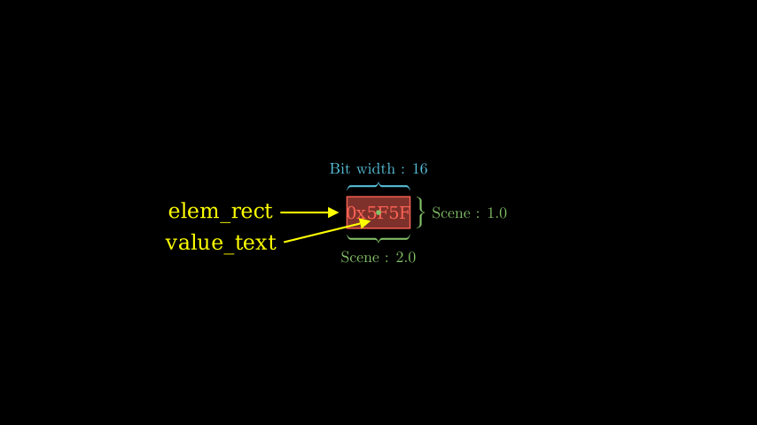
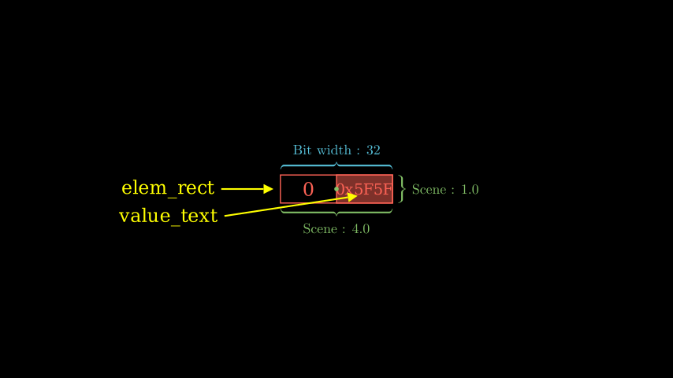

# Element Unit

`isa_manim.isa_objects.one_dim_reg_elem` presents one element in registers, function units, and memory units. This object can be used to present data reading from/writing to one register, moving between registers, function units, and memory units.

Source code: [*test_elem_unit.py*](https://github.com/wangeddie67/isa_manim/blob/main/tests/isa_objects/test_elem_unit.py)

As shown in the above figures, one element unit contains the following Manim objects:
- `elem_rect` presents the element.
  - The width of `elem_rect` presents the bit width of the register.
  - The height of `elem_rect` is 1.0.
  - In a normal situation, `elem_rect` is filled with the same color as the boundary. The opacity is set to 0.5.
- `value_text` presents the element's value, which is centrally aligned with `elem_rect`.

In the case of zero-extend, some MSBs are forced to zero. In this case, the element unit contains four Manim objects:
- `elem_rect` still presents the element as above. However, the `elem_rect` is transparent.
- `fill_elem_rect` covers the non-zero bits. 
- `value_text` presents the element's value, which is centrally aligned with `fill_elem_rect`.
- `fill_value_text` with a string of "0" covers the zero bits.

Source code: [*test_elem_unit_zero.py*](https://github.com/wangeddie67/isa_manim/blob/main/tests/isa_objects/test_elem_unit_zero.py)

> `fill_elem_rect` and `fill_value_text` are not public members.

> The origin point is located in the center position of `elem_rect`  as same as the center position of this object.

Element units can maintain a value as a normal variable. The option `value` in the constructor function specifies the element's value. Public member `elem_value` reads out the value.

If one element has been assigned a valid value, the value will be displayed. The format to print the value is defined by a format string as Python. For example, `":d"` means decimal format, and `"0x:x"` means hexadecimal format. The option `value_format` in the constructor function specifies the value format.

## ElemUnit

::: isa_manim.isa_objects.elem_unit.ElemUnit
