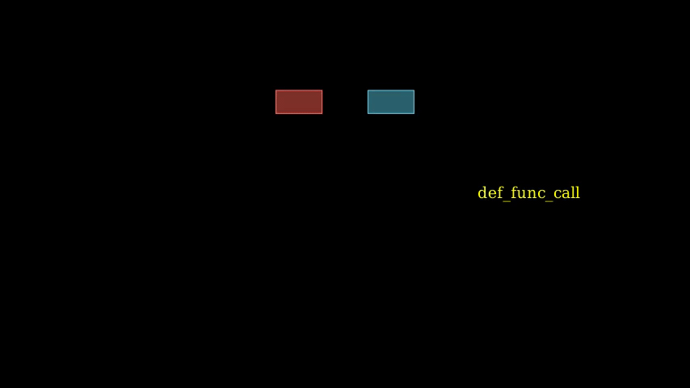

# Animations For Function Units

`isa_manim.isa_animate.function_animate.decl_function` declares one function unit by fading in.

`isa_manim.isa_animate.function_animate.read_func_imm` declares one immediate operand of one function unit. The immediate operand will fade in at the specified position while other operands move to their positions.

`isa_manim.isa_animate.function_animate.function_call` presents how elements pass through one function unit. The animation has two steps.

- In the first step, argument elements move to arguments of one function unit.
- In the second step, argument elements fade out while result elements fade in.

An example for `decl_function`, `read_func_imm` and `function_call` is as below:

Source code: [*test_func_animation.py*](https://github.com/wangeddie67/isa_manim/blob/main/tests/isa_animate/test_func_animation.py)

> The above functions generate a sequence of animations, but they do not register animation to Manim unless `play()` is applied on the result values

## function_animate

::: isa_manim.isa_animate.function_animate
    :members:
