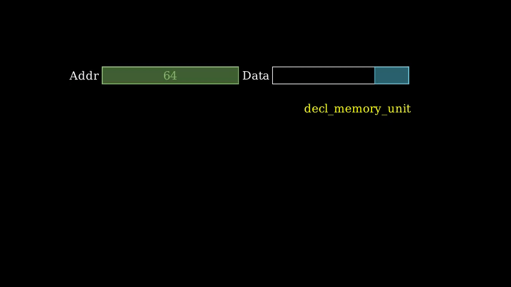
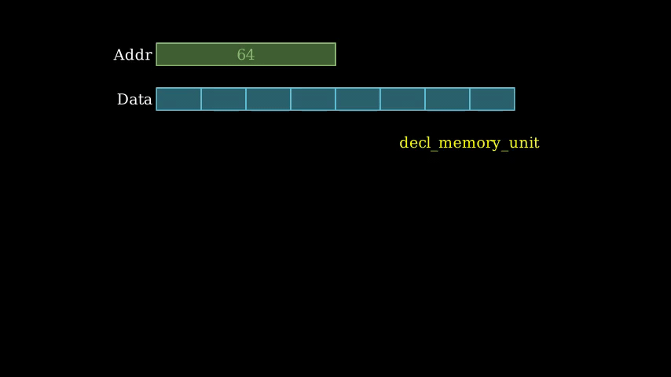

# Animations for Memory Units

`isa_manim.isa_animate.memory_animate.decl_memory_unit` declares one memory unit by fading in.

`isa_manim.isa_animate.memory_animate.read_memory` and `isa_manim.isa_animate.memory_animate.read_memory_without_addr` presents the animation to read data from memory. `isa_manim.isa_animate.memory_animate.write_memory` and `isa_manim.isa_animate.memory_animate.write_memory_without_addr` presents the animation to write data to memory. These four functions perform different animations according to some conditions of operations.

If the address element does not provide a valid address or the provided address does not match any memory map, the accessed memory locations cannot be marked on memory maps of the memory unit. In this situation, `read_memory_without_addr` and `write_memory_without_addr` are applied.

- By the first step in `read_memory_without_addr`, the address element moves to the address port. Then, the address element fades out while the data element fades in. At last, the data element can be observed at the data port.
- By the first step in `write_memory_without_addr`, the address element moves to the address port, and the data element moves to the data port first. Then, both the address element and the data element fade out.

Finally, a status element fades if the memory unit has a status port, and a status element is provided to function `read_memory_without_addr` and `write_memory_without_addr`.

An example for `decl_memory_unit`, `read_memory_without_addr` and `write_memory_without_addr` is as below:

Source code: [*test_memory_animation_without_addr.py*](https://github.com/wangeddie67/isa_manim/blob/main/tests/isa_animate/test_memory_animation_without_addr.py)

> `read_memory_without_addr` and `write_memory_without_addr` do not work with vector load/store instructions. If the memory unit allows parallel animations, the address elements and data elements for different vector elements will overlap together at the address port and then data port. If the memory unit does not allow parallel animations, the animation for one instruction has to cost a much longer time since elements must be handled one by one.

> The distribution of accessed memory locations is very important to explain the instruction behaviors. It is not suggested to use `read_memory_without_addr` and `write_memory_without_addr` in new animations. It is expected that address elements always have valid address values to present in memory maps.

Users are suggested to use `read_memory` and `write_memory` to generate animations with memory units. The major difference between `read_memory`/`write_memory` and `read_memory_without_addr`/`write_memory_without_addr` lies in that `read_memory`/`write_memory` marks the accessed memory locations. The animation has four steps: moving address elements, marking address position, marking address range, and fading in the status element.

The behavior in the first step depends on whether the memory unit allows parallel animation and whether the actual address matches the value in `addr_item` (presented by the option `addr_match`).

- Move the address element to the address port when the memory unit does not allow parallel animations and the actual address matches the value in `addr_item`.
  - Move the data element to the data port simultaneously when `write_memory` is called.
- Highlight the address element when the memory unit allows parallel animations and the actual address matches the value in `addr_item`.
- Otherwise, wait one second to keep animations synchronized for vector elements.

In the second step, the address element is transformed into the address mark on the matched memory map when the actual address matches the value in `addr_item`. The address mark is one triangle handed down. If the actual address to read is not the same as the value in `addr_item`, fade in the address mark.

In the third step, the behavior depends on whether the memory unit allows parallel animation.

- If the memory unit allows parallel animation,
  - `read_memory` creates one memory mark on the matched memory map.
  - `write_memory` transforms the data element into a data mark on the memory map.
- If the memory unit does not allow parallel animation,
  - `read_memory` creates one memory mark on the matched memory map and then transforms the memory map to a data element at the data port.
  - `write_memory` transforms the data element into a data mark on the memory map.

At last, a status element fades if the memory unit has a status port. Hence, if the status port applies, a status element is provided to function `read_memory_without_addr` and `write_memory_without_addr`.

Below is an example of `decl_memory_unit`, `read_memory`, and `write_memory` for serialization animations.

Source code: [*test_memory_animation.py*](https://github.com/wangeddie67/isa_manim/blob/main/tests/isa_animate/test_memory_animation.py)

Below is an example for `decl_memory_unit`, `read_memory`, and `write_memory` for parallel animations. The status port also has output in this example.

Source code: [*test_memory_animation_parallel.py*](https://github.com/wangeddie67/isa_manim/blob/main/tests/isa_animate/test_memory_animation_parallel.py)

> The above functions generate a sequence of animations, but they do not register animation to Manim unless `play()` is applied on the result values

## memory_animate

::: isa_manim.isa_animate.memory_animate
    :members:
