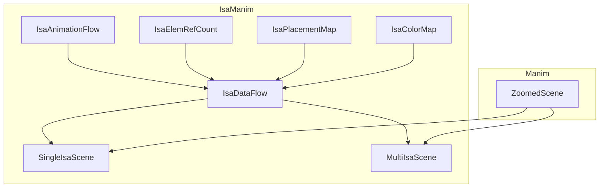

# Scene

`isa_scene` provides two animation scenes, `SingleIsaScene` and `MultiIsaScene`, for ISA animations. These two scenes hide the auto-scheduling and auto-placement behind APIs. 

The inherent relationship between components is shown in below figure:

The animation class is inherited from `SingleIsaScene` and `MultiIsaScene`. Meanwhile, `SingleIsaScene` and `MultiIsaScene` are inherited from `IsaDataFlow`. Hence, the animation class can directly apply these APIs to create animation.

The pages below introduce the implementation details for the auto-placement and auto-schedule of animations.

- The [Color map](31-color-map.md) (`IsaColorMap`) assigns color to element units automatically.
- The [Placement](32-placement.md) (`IsaPlacementMap`) automatically places the register, function, and memory units on the scene.0
- The [Animation flow](33-animation-flow.md) (`IsaAnimationFlow`) and the [Reference counter](34-refer-count.md) (`IsaElemRefCount`) introduce how to schedule the animation flow.

`IsaDataFlow` integrates `IsaAnimationFlow`, `IsaElemRefCount`, `IsaPlacementMap`, and `IsaColorMap`. Meanwhile, `IsaDataFlow` provides the animation API as the base of animation scenes. The list of APIs is listed in [Animation APIs](../../0-introductions/02-animation-apis.md). 
